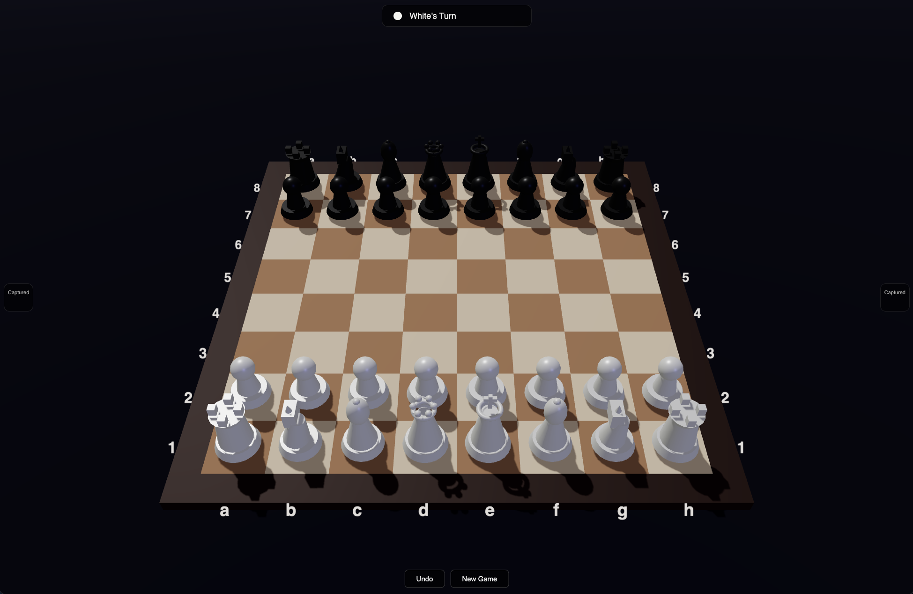
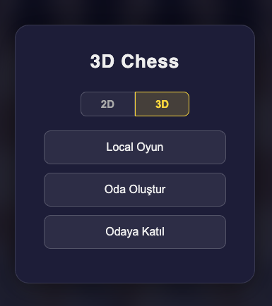
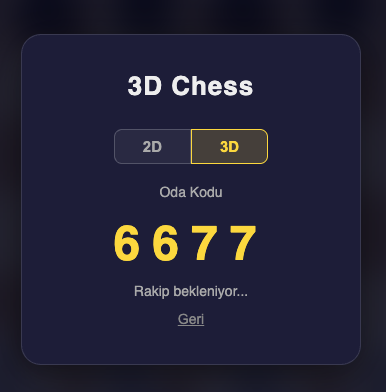
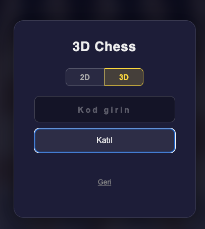

# 3D Chess

A web-based chess game with both 3D and 2D view modes, featuring local and online multiplayer.

## Screenshots

| 3D Board | 2D Board |
|:---:|:---:|
|  |  |

| Lobby | Create Room | Join Room |
|:---:|:---:|:---:|
|  |  |  |

## Features

- **3D & 2D View Modes** — Switch between a Three.js 3D board and a classic 2D canvas board
- **Local Multiplayer** — Play against a friend on the same device
- **Online Multiplayer** — Create or join a room with a 4-digit code via Socket.IO
- **Full Chess Rules** — Castling, en passant, pawn promotion, check/checkmate/stalemate detection
- **Move Animation** — Smooth piece movement with arc animation (3D mode)
- **Undo** — Take back moves in local games

## Tech Stack

- **Frontend:** HTML, CSS, JavaScript, [Three.js](https://threejs.org/)
- **Backend:** Node.js, Express, Socket.IO

## Getting Started

```bash
# Install dependencies
npm install

# Start the server
npm start
```

Then open `http://localhost:3000` in your browser.

## How to Play

1. Choose **2D** or **3D** view mode in the lobby
2. Select a game mode:
   - **Local Oyun** — Play locally
   - **Oda Oluştur** — Create an online room and share the code
   - **Odaya Katıl** — Join a room with a code
3. Click a piece to select it, then click a highlighted square to move
